# 🌡️ Smart Temperature & Humidity Monitor  
 

Sistem pemantauan suhu dan kelembapan berbasis **IoT**, dirancang untuk penggunaan di **gudang**, **ruang panel listrik**, dan **ruang server**.  
Alat ini melakukan **monitoring suhu & kelembapan secara real-time**, mengirimkan **notifikasi otomatis saat melewati batas**, serta mencatat data ke **Google Sheets** terintegrasi dengan akun Google pengguna.

> 💡 Solusi praktis, hemat daya, dan terhubung ke cloud — cocok untuk industri, teknisi, maupun usaha kecil.

---

## 🔧 Fitur Utama

- ✅ Monitoring suhu dan kelembapan secara near  real-time  
- ✅ Notifikasi otomatis saat suhu melewati batas atas/bawah  
- ✅ Aplikasi Android dengan grafik interaktif  
- ✅ WiFi provisioning langsung dari aplikasi  
- ✅ Pengaturan batas suhu & jadwal pengiriman data  
- ✅ Integrasi otomatis dengan Google Sheets akun google pengguna (tabel & grafik historis)  
- ✅ Fitur Organisasi & Manajemen Anggota — setiap anggota organisasi mendapat akses perangkat  
- ✅ Notifikasi ke Semua Anggota — jika suhu tidak normal, semua anggota langsung menerima peringatan  
- ✅ Login Google untuk keamanan & personalisasi data  

---

## ⚙️ Tech Spec

1. **DHT11** Sensor dengan rentang pengukuran suhu -40°C hingga 80°C akurasi ±0.5°C.
2. **Konektivitas** Wi-Fi 802.11 b/g/n (2.4 GHz).

---

## 📱 Cara Kerja

1. **Setup awal**: perangkat masuk ke mode WiFi provisioning → dikonfigurasi lewat aplikasi Android.  
2. Setelah tersambung, perangkat mulai **mengirimkan data suhu & kelembapan**.  
3. Aplikasi menampilkan data dalam bentuk **grafik real-time**.  
4. Jika data melewati batas, **notifikasi langsung dikirim ke semua anggota organisasi**.  
5. Data juga dapat dikirimkan secara terjadwal ke **Google Sheets** dari akun pengguna yang terhubung.  
6. Google Sheets menyajikan data dalam **tabel & grafik historis** yang mudah dipahami untuk analisis lebih lanjut.  

---

## 🎯 Cocok Untuk

- 🏭 Gudang penyimpanan — menjaga kualitas barang tetap terkontrol  
- ⚡ Ruang panel listrik — deteksi dini overheating peralatan  
- 🖥️ Ruang server — memastikan kestabilan suhu sistem  
- 📦 Lokasi sensitif lain yang butuh pemantauan suhu & kelembapan  

---

## 📷 Dokumentasi Perangkat

  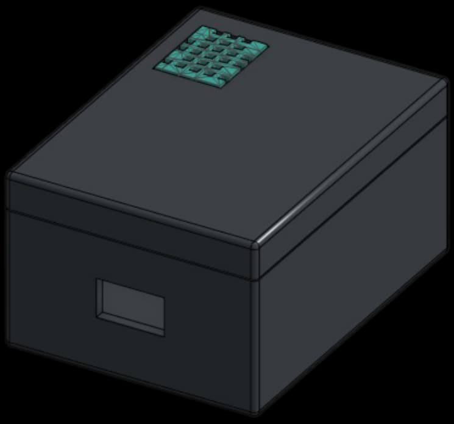
  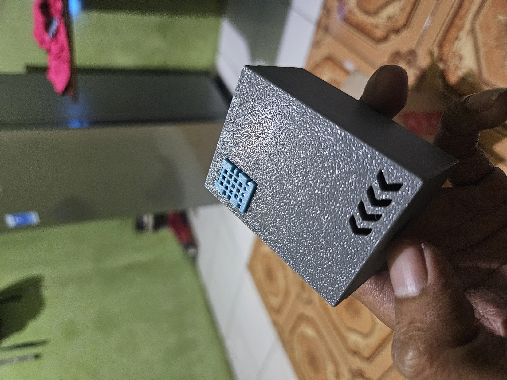

---

### 📱 Tampilan Aplikasi Android

<table>
  <tr>
    <td align="center">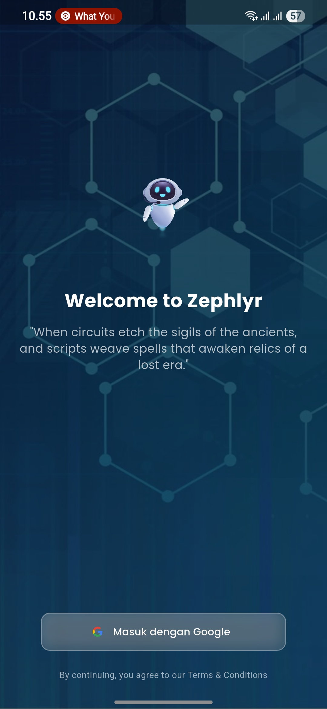 <b>Login Google</b></td>
    <td align="center">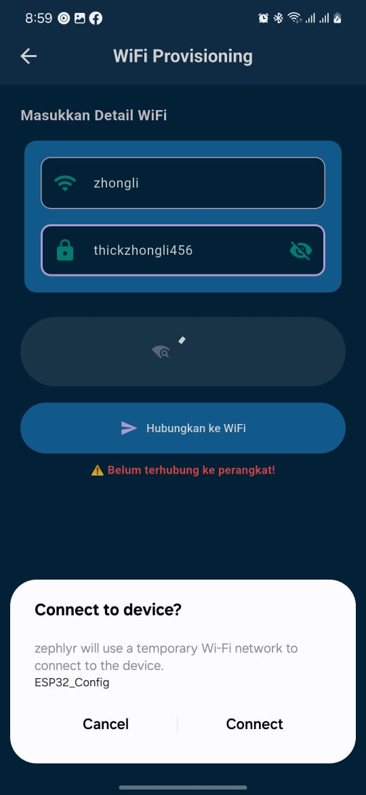 <b>WiFi Provisioning</b></td>
    <td align="center">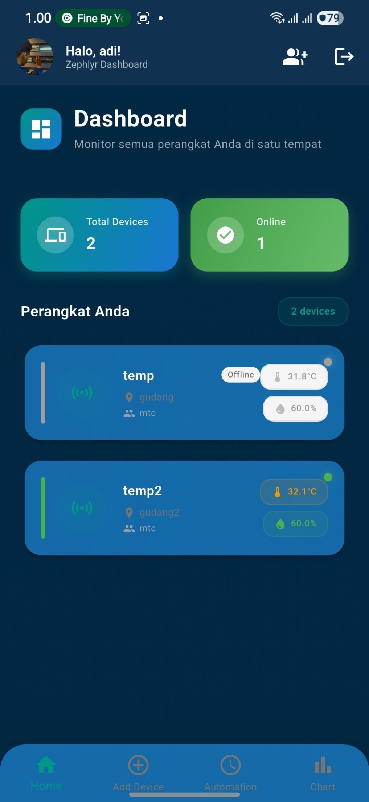 <b>Dashboard</b></td>
    <td align="center">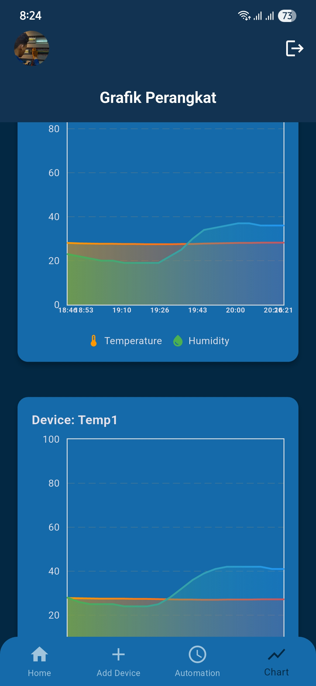 <b>Grafik Suhu</b></td>
  </tr>
  <tr>
    <td align="center">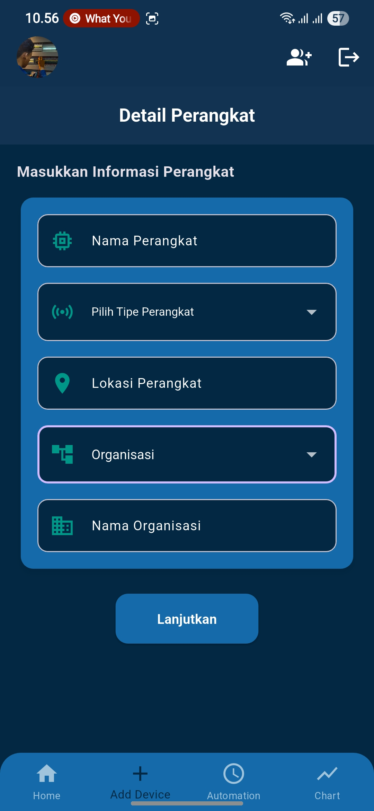 <b>Manajemen group</b></td>
    <td align="center">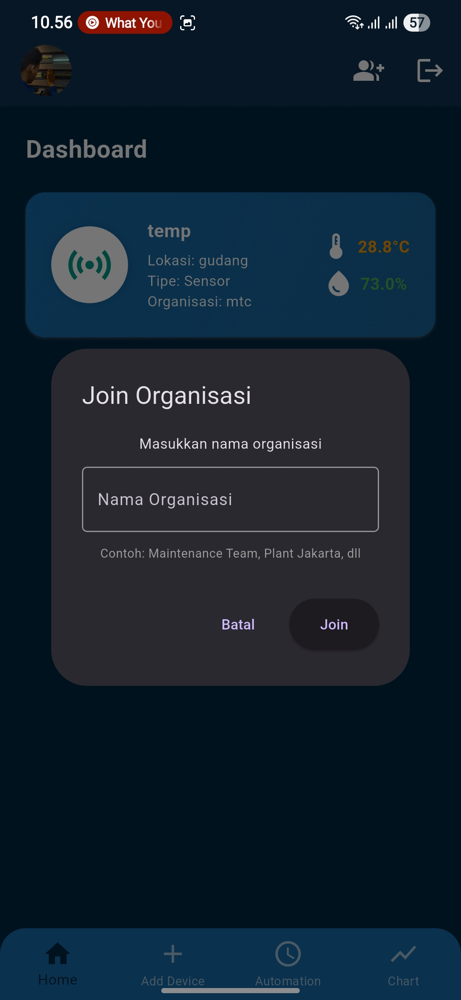 <b>Pengaturan Jadwal</b></td>
    <td align="center">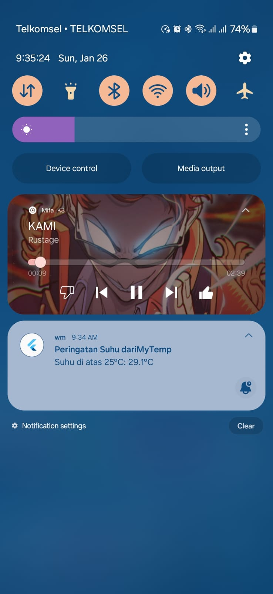 <b>Notifikasi</b></td>
    <td align="center">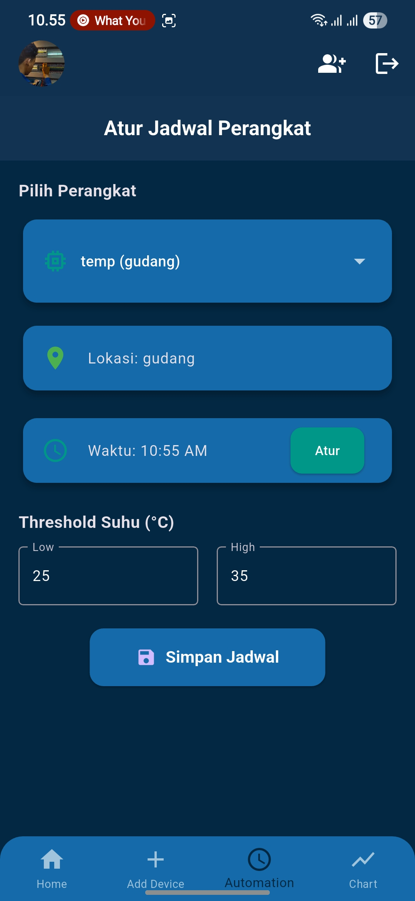 <b>Automasi</b></td>
  </tr>
</table>

---

---

## 🏢 Uji Coba Lapangan

Perangkat telah diuji di **MCC Room (Motor Control Center)** sebuah perusahaan untuk memantau suhu dan kelembapan ruangan yang berisi panel listrik berdaya tinggi.  

Hasil uji coba menunjukkan:  
- ✅ Data suhu dan kelembapan terbaca dengan stabil  
- ✅ Notifikasi berjalan ketika suhu melewati ambang batas  
- ✅ Data otomatis tercatat di Google Sheets  
- ✅ Sistem dapat digunakan oleh lebih dari satu anggota organisasi (teknisi lapangan & supervisor)  

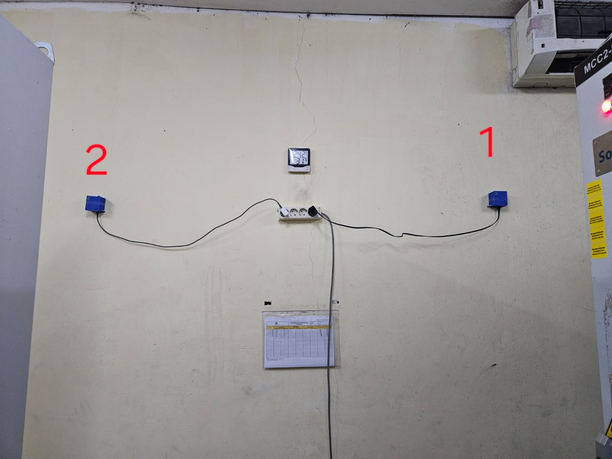
*Uji coba perangkat di ruang MCC*

## 📊 Contoh Output Google Sheets

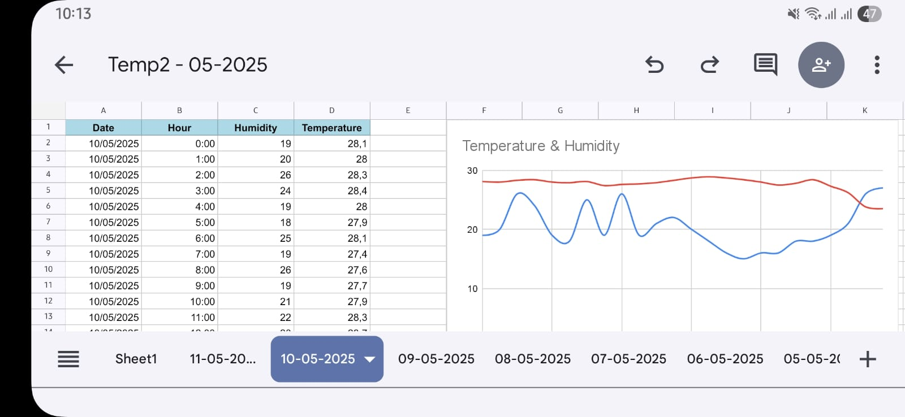

---

## 📣 Kolaborasi & Kontak

Tertarik dengan sistem monitoring suhu ini?  
Punya ide pengembangan, ingin bekerja sama, atau sekadar ingin tahu lebih banyak?  

> 

Saya terbuka untuk kolaborasi, pengembangan produk, maupun implementasi di berbagai kebutuhan industri & komersial.

---

Proyek ini berada di bawah lisensi MIT.  
Bebas digunakan dan dimodifikasi — mohon tetap mencantumkan atribusi.
